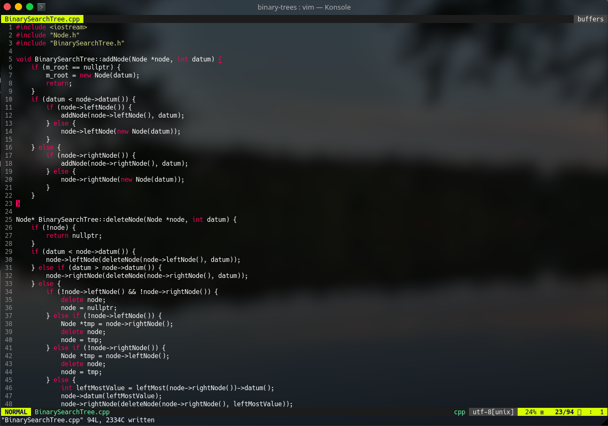

# vim-monokai-transparent

Monokai color scheme in Vim with background coloring removed, for use with transparent terminal emulators.

Forked from [sickill/vim-monokai](https://github.com/sickill/vim-monokai)

## Screenshots

## Installation

Put `monokai-transparent.vim` file in your `~/.vim/colors/` directory and add the following line to your `~/.vimrc`:

    syntax enable
    colorscheme monokai-transparent
